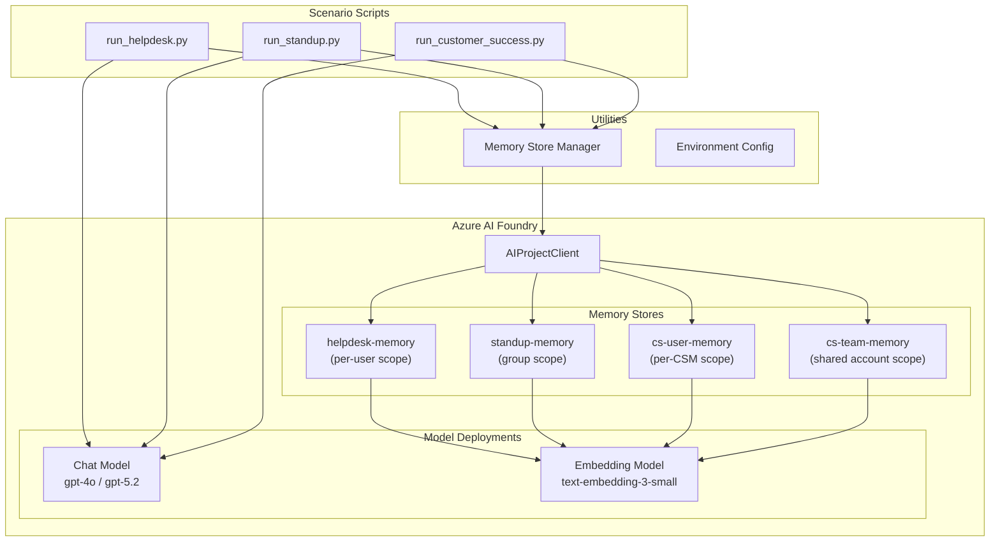

# Foundry Agent Memory — Demo Project

Practical demonstrations of [Microsoft Foundry Agents](https://learn.microsoft.com/azure/ai-foundry/agents/concepts/what-is-memory) long-term memory capabilities using the Microsoft Agent Framework.

This project implements three real-world scenarios that showcase how agent memory creates tangible value:

| Scenario | Memory Pattern | Value Demonstrated |
|----------|---------------|-------------------|
| **IT Help Desk** | Per-user memory | Returning users get contextual support without re-explaining their setup |
| **Standup Bot** | Group/shared memory | Any team member accesses knowledge accumulated across standups |
| **Customer Success** | Hybrid (per-user + group) | Seamless handoffs between team members with zero context loss |

---

## Architecture Overview



---

## Scenarios

### IT Help Desk (Per-User Memory)

**What it shows:** An agent that remembers individual users across sessions — their device, OS, past issues, and resolutions.

**Memory configuration:**
- Store: `helpdesk-memory`
- Scope: `user_{id}` (per-user)
- Chat summary: ✅
- User profile: ✅ (role, department, OS, device model, RAM, software versions, past issues)

**Run:**
```bash
python -m src.scenarios.run_helpdesk
```

**What you'll see:**

- **Session 1** — No prior memory. Agent asks clarifying questions about OS, device model, and setup.
- **Session 2** — Memory recall. Agent skips known information: *"Since you're on your Surface Pro 9 with the prior crash history, let's check if the display driver update from last time held..."*
- **Session 3** — Profile evolution. Agent leverages accumulated context for faster, more targeted support.

---

### Standup Bot (Group Memory)

**What it shows:** A shared team memory that persists across daily standups — tracks blockers, progress, and patterns.

**Memory configuration:**
- Store: `standup-memory`
- Scope: `team-alpha` (shared group)
- Chat summary: ✅
- User profile: ❌

**Run:**
```bash
python -m src.scenarios.run_standup
```

**What you'll see:**

- **Day 1** — Initial standup with 3 team members. Agent records status and blockers.
- **Day 2** — Contextual follow-ups. Agent detects recurring blockers: *"This is day 2 blocked on API team. Should we escalate?"*
- **Summary** — Agent generates a standup summary highlighting patterns and action items.

---

### Customer Success (Hybrid Per-User + Group Memory)

**What it shows:** Dual memory stores — individual CSM context (interaction style, portfolio) combined with shared account intelligence accessible to the entire team.

**Memory configuration:**
- User store: `cs-user-memory` — scope: `csm_{name}` (per-CSM)
- Team store: `cs-team-memory` — scope: `account-acme` (shared)
- Chat summary: ✅ (both stores)
- User profile: ✅ (user store only)

**Run:**
```bash
python -m src.scenarios.run_customer_success
```

**What you'll see:**

- **Sarah** — Builds account knowledge through client interactions; personal context + shared intel accumulate.
- **Mike (handoff)** — Picks up the account with full context from shared memory; no "starting from scratch."
- **Sarah returns** — Finds all accumulated intelligence from Mike's interactions in shared memory.

---

## Prerequisites

- **Python 3.11+**
- **Azure subscription** with:
  - AI Foundry project provisioned
  - Chat model deployment (e.g., `gpt-4o`)
  - Embedding model deployment (e.g., `text-embedding-3-small`)
  - System-assigned managed identity enabled on project
  - **Azure AI User** role assigned to project managed identity on AI Services resource
- **Azure CLI** authenticated (`az login`)

---

## Quick Start

```bash
# Clone
git clone <repo-url>
cd foundry-agent-memory

# Configure
cp .env.example .env
# Edit .env with your Foundry project endpoint and model deployment names

# Install
python -m venv .venv
.venv\Scripts\activate  # Windows
# source .venv/bin/activate  # macOS/Linux
pip install -r requirements.txt

# Run a scenario
python -m src.scenarios.run_helpdesk
python -m src.scenarios.run_standup
python -m src.scenarios.run_customer_success
```

---

## Memory Store Configuration Reference

| Scenario | Store Name | Scope | Chat Summary | User Profile | Profile Details |
|----------|-----------|-------|:---:|:---:|----------------|
| Help Desk | `helpdesk-memory` | `user_{id}` | ✅ | ✅ | role, dept, OS, device model, RAM, software versions, past issues |
| Standup | `standup-memory` | `team-alpha` | ✅ | ❌ | — |
| Customer Success (user) | `cs-user-memory` | `csm_{name}` | ✅ | ✅ | interaction style, client portfolio, specialization areas |
| Customer Success (team) | `cs-team-memory` | `account-acme` | ✅ | ❌ | — |

---

## Cleanup

Remove demo memory stores from your Foundry project:

```bash
python -m src.cleanup                       # Interactive — prompts before deleting
python -m src.cleanup --scenario helpdesk   # Delete only helpdesk stores
python -m src.cleanup --all                 # Delete all demo stores without prompting
```

---

## Project Structure

```
foundry-agent-memory/
├── .env.example                    # Environment template (copy to .env)
├── .gitignore
├── requirements.txt                # Python dependencies
├── pyproject.toml                  # Project metadata
├── README.md                       # This file
├── docs/
│   ├── prd/
│   │   ├── 00-overview.md          # Product requirements overview
│   │   ├── 01-architecture.md      # Architecture & data model
│   │   ├── 02-scenarios.md         # Detailed scenario specifications
│   │   ├── 03-non-functional-requirements.md
│   │   └── 04-task-backlog.md      # Development task breakdown
│   └── tasks/
│       ├── README.md               # Task execution order
│       └── dev/
│           └── DEV-001..008.md     # Individual task files
└── src/
    ├── __init__.py
    ├── cleanup.py                  # Memory store cleanup utility
    ├── scenarios/
    │   ├── __init__.py
    │   ├── helpdesk.py             # IT Help Desk scenario logic
    │   ├── run_helpdesk.py         # Help Desk entry point
    │   ├── standup.py              # Standup Bot scenario logic
    │   ├── run_standup.py          # Standup Bot entry point
    │   ├── customer_success.py     # Customer Success scenario logic
    │   └── run_customer_success.py # Customer Success entry point
    └── utils/
        ├── __init__.py
        ├── env.py                  # Environment variable loading
        ├── memory_manager.py       # Memory store CRUD operations
        └── console.py             # Rich console output formatting
```

---

## Troubleshooting

| Issue | Solution |
|-------|----------|
| `RuntimeError: Missing required environment variables` | Copy `.env.example` to `.env` and fill in all values |
| `AuthenticationError` | Run `az login` and ensure the correct subscription is selected |
| `No embedding model available` | Deploy `text-embedding-3-small` in your AI Foundry project |
| `Memory store creation fails` | Verify managed identity is enabled and has **Azure AI User** role on the AI Services resource |
| `ModuleNotFoundError` | Ensure you activated the virtual environment and ran `pip install -r requirements.txt` |

---

## References

- [Memory Tool Documentation](https://learn.microsoft.com/azure/ai-foundry/agents/how-to/memory-usage?view=foundry)
- [Memory Concepts](https://learn.microsoft.com/azure/ai-foundry/agents/concepts/what-is-memory)
- [Microsoft Agent Framework](https://github.com/microsoft/agent-framework)
- [Azure AI Projects SDK](https://pypi.org/project/azure-ai-projects/)
