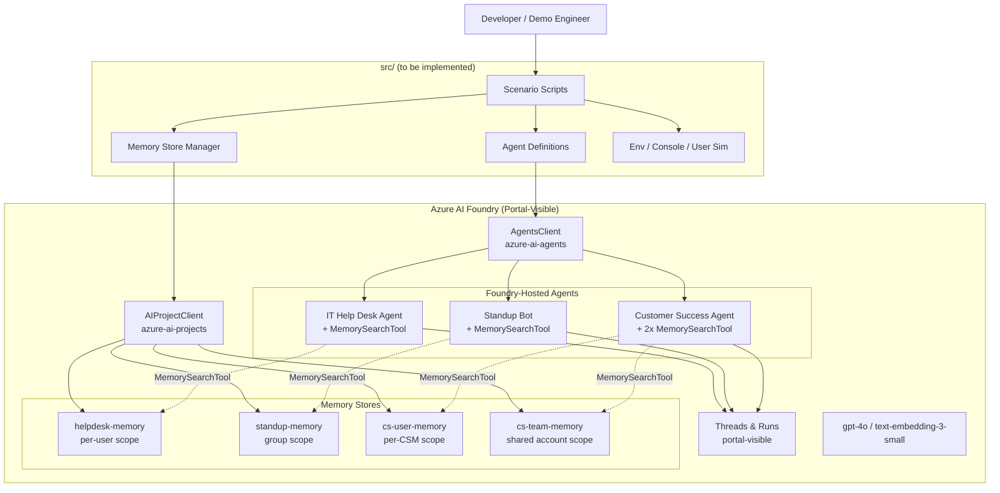

# Foundry Agent Memory — Demo Project

> **Status: Planning / Pre-Implementation.** Requirements and task plan are approved (PRD v0.1.0, Task Plan v0.2.0). Source code has not been implemented yet. See [Implementation Status](#implementation-status) for details.

Practical demonstrations of [Microsoft Foundry Agents](https://learn.microsoft.com/azure/ai-foundry/agents/concepts/what-is-memory) long-term memory capabilities, built on the **Foundry Agents Service** (`azure-ai-agents`) with portal-visible agents and memory stores.

This project will implement three real-world scenarios that showcase how agent memory creates tangible value:

| Scenario | Memory Pattern | Value Demonstrated |
|----------|---------------|-------------------|
| **IT Help Desk** | Per-user memory | Returning users get contextual support without re-explaining their setup |
| **Standup Bot** | Group/shared memory | Any team member accesses knowledge accumulated across standups |
| **Customer Success** | Hybrid (per-user + group) | Seamless handoffs between team members with zero context loss |

A core requirement is that **every agent and memory store created by these scenarios is visible and inspectable in the Azure AI Foundry portal** — agents are created via `project_client.agents.create_agent()` (Foundry Agents Service), conversations run through the portal-visible threads/runs API, and memory data can be inspected via portal or a planned `inspect_memory.py` utility.

---

## Implementation Status

This repository currently contains **only documentation, configuration, and planning artifacts**. No source code has been written yet. The `src/` directory will be created as part of [DEV-001](docs/tasks/dev/DEV-001.md).

### Task Plan (12 tasks, 4 phases)

See [docs/tasks/README.md](docs/tasks/README.md) for the master plan and [docs/tasks/dev/](docs/tasks/dev/) for individual task files.

| Phase | Goal | Tasks |
|-------|------|-------|
| **1: Foundation** | Project structure, dependencies, env config | [DEV-001](docs/tasks/dev/DEV-001.md), [DEV-002](docs/tasks/dev/DEV-002.md) |
| **2: Core Infrastructure** | Memory store manager, Foundry Agents Service agent definitions, user simulator, console formatter | [DEV-003](docs/tasks/dev/DEV-003.md), [DEV-004](docs/tasks/dev/DEV-004.md), [DEV-005](docs/tasks/dev/DEV-005.md), [DEV-006](docs/tasks/dev/DEV-006.md) |
| **3: Scenarios** | Three portal-visible scenario scripts | [DEV-007](docs/tasks/dev/DEV-007.md), [DEV-008](docs/tasks/dev/DEV-008.md), [DEV-009](docs/tasks/dev/DEV-009.md) |
| **4: Utilities & Docs** | Cleanup, memory inspection, this README expansion | [DEV-010](docs/tasks/dev/DEV-010.md), [DEV-011](docs/tasks/dev/DEV-011.md), [DEV-012](docs/tasks/dev/DEV-012.md) |

All tasks are at status `Backlog`. The "Quick Start", "Cleanup", and per-scenario run instructions in this README describe the **target experience** once implementation is complete — they will not work today.

---

## Planned Architecture



For full architectural detail, see [docs/prd/01-architecture.md](docs/prd/01-architecture.md).

---

## Planned Scenarios

### IT Help Desk (Per-User Memory) — [DEV-007](docs/tasks/dev/DEV-007.md)

**What it will show:** An agent that remembers individual users across sessions — their device, OS, past issues, and resolutions.

**Memory configuration:**
- Store: `helpdesk-memory`
- Scope: `user_{id}` (per-user)
- Chat summary: ✅
- User profile: ✅ (role, department, OS, device model, RAM, software versions, past issues)

**Planned flow:**
- **Session 1** — No prior memory. Agent asks clarifying questions about OS, device model, and setup.
- **Session 2** — Memory recall. Agent references stored profile: *"Since you're on your Surface Pro 9 with the prior crash history…"*
- **Session 3** — Profile evolution. Agent leverages accumulated context for faster, more targeted support.

---

### Standup Bot (Group Memory) — [DEV-008](docs/tasks/dev/DEV-008.md)

**What it will show:** A shared team memory that persists across daily standups — tracks blockers, progress, and patterns.

**Memory configuration:**
- Store: `standup-memory`
- Scope: `team-alpha` (shared group)
- Chat summary: ✅
- User profile: ❌

**Planned flow:**
- **Day 1** — Initial standup with 3 team members. Agent records status and blockers.
- **Day 2** — Contextual follow-ups. Agent detects recurring blockers: *"This is day 2 blocked on API team. Should we escalate?"*
- **Summary** — Agent generates a standup summary highlighting patterns and action items.

---

### Customer Success (Hybrid Per-User + Group Memory) — [DEV-009](docs/tasks/dev/DEV-009.md)

**What it will show:** Dual memory stores — individual CSM context (style, portfolio) combined with shared account intelligence accessible to the whole team.

**Memory configuration:**
- User store: `cs-user-memory` — scope: `csm_{name}` (per-CSM)
- Team store: `cs-team-memory` — scope: `account-acme` (shared)
- Chat summary: ✅ (both stores)
- User profile: ✅ (user store only)

**Planned flow:**
- **Sarah** — Builds account knowledge; personal context + shared intel accumulate.
- **Mike (handoff)** — Picks up the account with full context from shared memory.
- **Sarah returns** — Finds all accumulated intelligence from Mike's interactions in shared memory.

---

## Prerequisites (for when implementation is complete)

- **Python 3.11+**
- **Azure subscription** with:
  - AI Foundry project provisioned
  - Chat model deployment (e.g., `gpt-4o` or `gpt-5.2`)
  - Embedding model deployment (e.g., `text-embedding-3-small`)
  - Foundry Memory Stores enabled (preview feature)
  - Appropriate RBAC role on the AI Services resource (e.g., **Azure AI User**)
- **Azure CLI** authenticated (`az login`)

---

## Target Quick Start (post-implementation)

> The commands below will work once Phases 1–3 are complete. Today, only the configuration files exist.

```bash
# Clone
git clone <repo-url>
cd foundry-agent-memory

# Configure
cp .env.example .env
# Edit .env with your Foundry project endpoint and model deployment names

# Install
python -m venv .venv
.venv\Scripts\activate          # Windows
# source .venv/bin/activate     # macOS/Linux
pip install -r requirements.txt

# Run a scenario (after DEV-007/008/009 are implemented)
python -m src.scenarios.helpdesk
python -m src.scenarios.standup
python -m src.scenarios.customer_success
```

After running, open the [Azure AI Foundry portal](https://ai.azure.com) → your project → **Agents** blade to see the created agent and its `MemorySearchTool`. Open the **Memory** section to inspect the store configuration and stored data.

---

## Memory Store Configuration Reference

| Scenario | Store Name | Scope | Chat Summary | User Profile | Profile Details |
|----------|-----------|-------|:---:|:---:|----------------|
| Help Desk | `helpdesk-memory` | `user_{id}` | ✅ | ✅ | role, dept, OS, device model, RAM, software versions, past issues |
| Standup | `standup-memory` | `team-alpha` | ✅ | ❌ | — |
| Customer Success (user) | `cs-user-memory` | `csm_{name}` | ✅ | ✅ | interaction style, client portfolio, specialization areas |
| Customer Success (team) | `cs-team-memory` | `account-acme` | ✅ | ❌ | — |

---

## Planned Utilities

### Cleanup ([DEV-010](docs/tasks/dev/DEV-010.md))
Will remove demo memory stores **and** Foundry-hosted agents created by this project:

```bash
python cleanup.py                       # Interactive — prompts before deleting
python cleanup.py --scenario helpdesk   # Delete only helpdesk resources
python cleanup.py --all                 # Delete all demo resources without prompting
```

### Memory Inspection ([DEV-011](docs/tasks/dev/DEV-011.md))
Will display stored memory contents (scopes, profiles, chat summaries) via the SDK as a portal-inspection alternative:

```bash
python inspect_memory.py                          # Inspect all demo stores
python inspect_memory.py --store helpdesk-memory  # One store
python inspect_memory.py --scope user_123         # One scope
```

---

## Current Repository Structure

```
foundry-agent-memory/
├── .env.example                    # Environment template
├── .gitignore                      # Includes .env
├── requirements.txt                # Python dependencies (azure-ai-agents, azure-ai-projects, azure-identity, python-dotenv)
├── pyproject.toml                  # Project metadata
├── README.md                       # This file
└── docs/
    ├── prd/
    │   ├── 00-overview.md          # Product overview & success metrics
    │   ├── 01-architecture.md      # Architecture, data model, design decisions
    │   ├── 02-scenarios.md         # Functional requirements (REQ-F-001..036)
    │   ├── 03-non-functional-requirements.md
    │   └── 04-task-backlog.md      # PRD-level task backlog
    └── tasks/
        ├── README.md               # Master task plan v0.2.0
        └── dev/
            └── DEV-001..012.md     # Individual implementation tasks
```

### Planned `src/` Structure (to be created in DEV-001)

```
src/
├── __init__.py
├── common/
│   ├── env.py                      # DEV-002: env var loading & validation
│   └── user_simulator.py           # DEV-005: scripted user messages
├── memory/
│   ├── store_manager.py            # DEV-003: memory store CRUD via AIProjectClient
│   └── config.py                   # DEV-003: per-scenario store configuration presets
├── agents/
│   └── agent_definitions.py        # DEV-004: Foundry Agents Service agent creation + threads/runs helpers
├── scenarios/
│   ├── helpdesk.py                 # DEV-007
│   ├── standup.py                  # DEV-008
│   └── customer_success.py         # DEV-009
└── console.py                      # DEV-006: rich output formatting
```

Plus root-level utilities `cleanup.py` and `inspect_memory.py`.

---

## Key Design Decisions

See [docs/prd/01-architecture.md § 6](docs/prd/01-architecture.md) for full rationale. Highlights:

- **ADD-007 (Accepted)** — Agents are created via the Foundry Agents Service (`project_client.agents.create_agent()`) with `MemorySearchTool`, NOT via the local Agent Framework. This is required for portal visibility.
- **ADD-008 (Accepted)** — Memory data must be inspectable post-demo, either via the Foundry portal or via the `inspect_memory.py` utility.
- **ADD-001 (Accepted)** — Each scenario is a self-contained CLI script, not a unified application.

---

## How to Contribute / Continue Implementation

1. Pick the next unblocked task from [docs/tasks/README.md](docs/tasks/README.md) (start with [DEV-001](docs/tasks/dev/DEV-001.md))
2. Read the task file's Acceptance Criteria, Technical Notes, and Files to Create/Modify
3. Implement the task
4. Update the task `Status:` from `Backlog` → `Complete`
5. Move to the next unblocked task

---

## References

- [Memory Tool Documentation (Python)](https://learn.microsoft.com/azure/ai-foundry/agents/how-to/memory-usage?pivots=python)
- [Memory Concepts](https://learn.microsoft.com/azure/ai-foundry/agents/concepts/what-is-memory)
- [Azure AI Agents SDK (`azure-ai-agents`)](https://pypi.org/project/azure-ai-agents/)
- [Azure AI Projects SDK (`azure-ai-projects`)](https://pypi.org/project/azure-ai-projects/)
- [Azure AI Foundry Portal](https://ai.azure.com)
