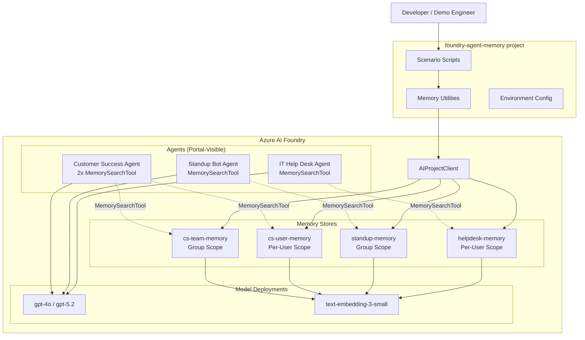
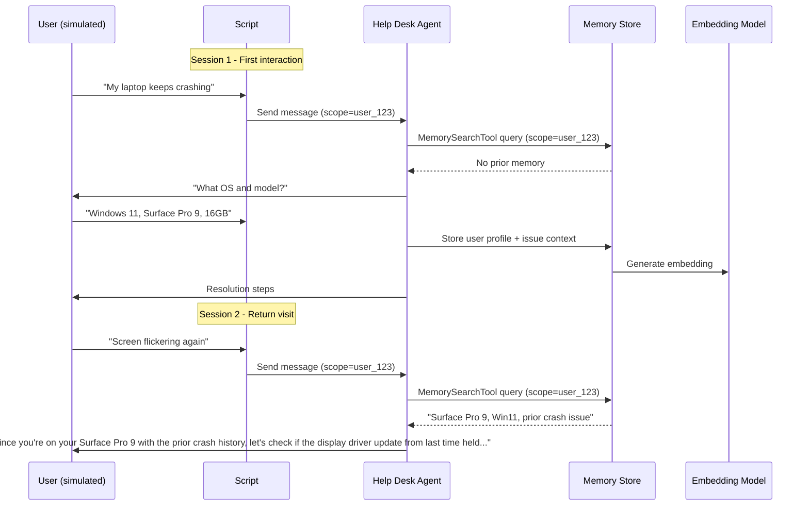
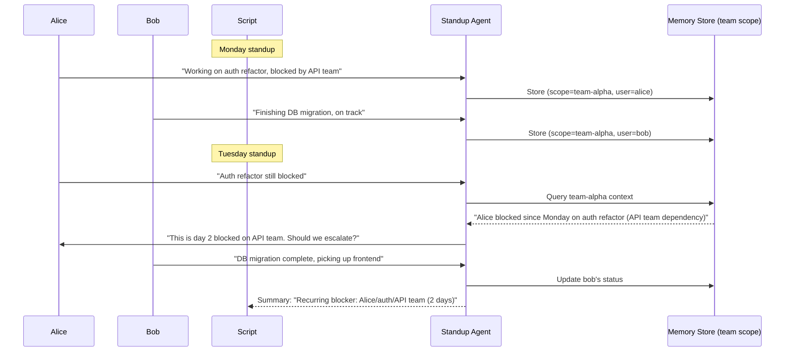

# Architecture Overview
## Version: 0.1.0

## 1. System Context Diagram

## 2. Component Architecture

```mermaid
graph LR
    subgraph "src/"
        subgraph "scenarios/"
            S1[helpdesk.py]
            S2[standup.py]
            S3[customer_success.py]
        end
        subgraph "memory/"
            MU[store_manager.py]
            MC[config.py]
        end
        subgraph "agents/"
            AD[agent_definitions.py]
        end
        subgraph "common/"
            ENV[env.py]
            SIM[user_simulator.py]
        end
    end
    
    S1 --> MU
    S2 --> MU
    S3 --> MU
    S1 --> AD
    S2 --> AD
    S3 --> AD
    S1 --> SIM
    S2 --> SIM
    S3 --> SIM
    MU --> MC
    MC --> ENV
```

## 3. Data Flow

### Per-User Memory Flow (IT Help Desk)

### Group Memory Flow (Standup Bot)

## 4. Data Model

| Entity | Key Fields | Relationships |
|--------|-----------|---------------|
| Memory Store | `id`, `name`, `embedding_model_deployment`, `chat_summary_enabled`, `user_profile_enabled`, `user_profile_details` | Has many Scopes |
| Scope | `scope_id` (e.g., `user_123`, `team-alpha`) | Belongs to Memory Store; contains memory entries |
| Memory Entry | `content`, `embedding`, `timestamp`, `metadata` | Belongs to Scope |
| Agent | `id`, `name`, `instructions`, `tools[]` | Created via Foundry Agents Service; visible in portal; references Memory Store via `MemorySearchTool` |

### Memory Store Configurations

| Scenario | Store Name | Scope Strategy | chat_summary | user_profile | user_profile_details |
|----------|-----------|---------------|--------------|--------------|---------------------|
| IT Help Desk | `helpdesk-memory` | `{{$userId}}` (per-user) | `true` | `true` | "role, department, OS, device model, RAM, software versions, past issues and resolutions, communication preference" |
| Standup Bot | `standup-memory` | Static team ID (e.g., `team-alpha`) | `true` | `false` | N/A |
| Customer Success (user) | `cs-user-memory` | `{{$userId}}` (per-CSM) | `true` | `true` | "interaction style, client portfolio, specialization areas" |
| Customer Success (team) | `cs-team-memory` | Static account ID (e.g., `account-acme`) | `true` | `false` | N/A |

## 5. Technology Stack

| Layer | Technology | Rationale |
|-------|-----------|-----------|
| Language | Python 3.11+ | Foundry SDKs are Python-first |
| Foundry Agents SDK | `azure-ai-agents` | Agent CRUD, MemorySearchTool, threads/runs — portal-visible agents |
| Azure SDK | `azure-ai-projects`, `azure-identity` | Memory Store CRUD (`client.beta.memory_stores`), auth |
| Chat Model | `gpt-4o` or `gpt-5.2` | Agent reasoning |
| Embedding Model | `text-embedding-3-small` | Memory store embeddings |
| Config | python-dotenv + `.env` | Simple local config |
| Package Manager | pip + `requirements.txt` | Simplicity for demo |

## 6. Key Design Decisions

| ID | Decision | Rationale | Status |
|----|----------|-----------|--------|
| ADD-001 | CLI scripts per scenario, not a unified app | Each scenario is self-contained and independently runnable for demos | Accepted |
| ADD-002 | Simulated users via script (not real auth) | Demo simplicity; real auth would require AAD app registration setup | Accepted |
| ADD-003 | Shared `store_manager.py` for memory CRUD | DRY; all scenarios need create/configure/teardown | Accepted |
| ADD-004 | Use `{{$userId}}` scope for per-user, static strings for group | Matches documented Foundry memory scoping patterns | Accepted |
| ADD-005 | Single `requirements.txt`, no poetry/pdm | Lowest barrier to entry for demo consumers | Accepted |
| ADD-006 | Include cleanup/teardown utility | Prevent orphaned memory stores in dev subscriptions | Accepted |
| ADD-007 | Use Foundry Agents Service API for agent creation (not only local Agent Framework) | Agents must be visible in the Azure AI Foundry portal with MemorySearchTool attached; portal visibility is a demo requirement (REQ-F-034). Agents created via `project_client.agents.create_agent()` are registered server-side and inspectable in the portal. Conversations run via the threads/runs API. | Accepted |
| ADD-008 | Memory data must be inspectable post-demo | Demo engineers need to show stored memory (profiles, summaries, scoped entries) in the Foundry portal or via a utility script (REQ-F-036) | Accepted |

## 7. Security Architecture

- **Authentication**: `DefaultAzureCredential` — supports local dev (Azure CLI login) and managed identity
- **Secrets**: All connection strings and endpoints in `.env` (gitignored); `.env.example` committed with placeholders
- **No PII in source**: Simulated user data only; no real user information in scripts
- **Memory Store access**: Controlled by Azure RBAC on the AI Foundry project
- **Scope isolation**: Per-user scopes ensure one user's memory is not accessible to queries scoped to another user

## 8. Observability Architecture

- **Logging**: Python `logging` module at INFO level; DEBUG available via env var
- **Console output**: Rich formatted output showing memory retrieval vs. fresh response (makes memory value visible)
- **No external telemetry**: Demo project; no Application Insights or distributed tracing needed

## 9. Infrastructure Requirements (Non-Implementation)

| Resource | Configuration | Notes |
|----------|--------------|-------|
| Azure AI Foundry Project | Standard tier | Must support Memory Stores |
| Chat model deployment | `gpt-4o` or `gpt-5.2`, standard throughput | Agent reasoning |
| Embedding model deployment | `text-embedding-3-small` | Memory embeddings |
| Azure subscription | Contributor or AI Developer role | For resource provisioning |
