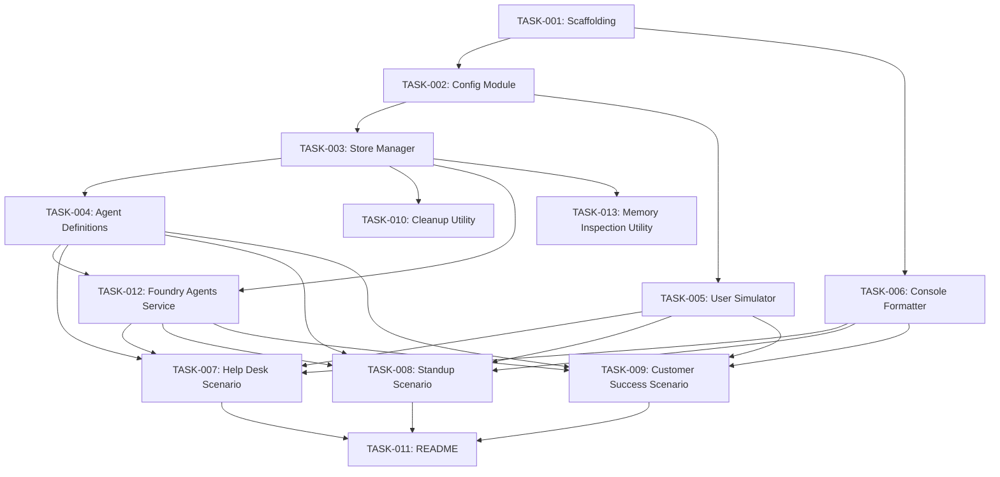

# Task Backlog (Agent Handoff)
## Version: 0.2.0

This file is the contract for downstream development agents.

---

## TASK-001: Project Scaffolding
- **Source Requirements**: [REQ-F-031, REQ-NF-001, REQ-NF-005, REQ-NF-006]
- **Type**: Infrastructure
- **Priority**: P0
- **Estimated Complexity**: S
- **Dependencies**: []
- **Acceptance Criteria**:
  - [ ] Directory structure created (`src/scenarios/`, `src/memory/`, `src/agents/`, `src/common/`)
  - [ ] `requirements.txt` with all dependencies (`azure-ai-projects`, `azure-ai-agents`, `azure-identity`, `python-dotenv`)
  - [ ] `.env.example` with documented variables
  - [ ] `.gitignore` includes `.env`
  - [ ] Python 3.11+ compatible
- **Agent Assignment**: unassigned
- **Status**: Backlog

## TASK-002: Environment & Config Module
- **Source Requirements**: [REQ-F-031, REQ-NF-004]
- **Type**: Infrastructure
- **Priority**: P0
- **Estimated Complexity**: S
- **Dependencies**: [TASK-001]
- **Acceptance Criteria**:
  - [ ] `src/common/env.py` loads and validates `.env` variables
  - [ ] Clear error messages for missing configuration
  - [ ] Exposes typed config object for use by other modules
- **Agent Assignment**: unassigned
- **Status**: Backlog

## TASK-003: Memory Store Manager
- **Source Requirements**: [REQ-F-030, REQ-F-035, REQ-NF-003]
- **Type**: Feature
- **Priority**: P0
- **Estimated Complexity**: M
- **Dependencies**: [TASK-002]
- **Acceptance Criteria**:
  - [ ] `src/memory/store_manager.py` implements create, list, delete store, delete scope
  - [ ] Idempotent creation (no errors on re-run)
  - [ ] Uses `AIProjectClient` from `azure-ai-projects` (`client.beta.memory_stores.create()`)
  - [ ] `src/memory/config.py` defines store configuration presets per scenario
  - [ ] Created stores visible in Azure AI Foundry portal
- **Agent Assignment**: unassigned
- **Status**: Backlog

## TASK-004: Agent Definitions Module (Foundry Agents Service)
- **Source Requirements**: [REQ-F-002, REQ-F-011, REQ-F-022, REQ-F-034]
- **Type**: Feature
- **Priority**: P0
- **Estimated Complexity**: L
- **Dependencies**: [TASK-003]
- **Acceptance Criteria**:
  - [ ] `src/agents/agent_definitions.py` creates agents via `project_client.agents.create_agent()`
  - [ ] Each agent has `MemorySearchTool` attached referencing correct memory store(s)
  - [ ] Customer Success agent has dual MemorySearchTool (two stores)
  - [ ] Provides helper for threads/runs conversation pattern
  - [ ] Created agents visible in Foundry portal (Agents blade)
  - [ ] Agent creation is idempotent
- **Agent Assignment**: unassigned
- **Status**: Backlog

## TASK-005: User Simulator Utility
- **Source Requirements**: [REQ-F-003, REQ-F-012, REQ-F-023]
- **Type**: Feature
- **Priority**: P0
- **Estimated Complexity**: S
- **Dependencies**: [TASK-002]
- **Acceptance Criteria**:
  - [ ] `src/common/user_simulator.py` provides scripted user messages for each scenario
  - [ ] Supports multi-turn conversations with multiple simulated users
  - [ ] User IDs are consistent across sessions (for memory continuity testing)
- **Agent Assignment**: unassigned
- **Status**: Backlog

## TASK-006: Console Output Formatter
- **Source Requirements**: [REQ-F-033, REQ-NF-007]
- **Type**: Feature
- **Priority**: P1
- **Estimated Complexity**: S
- **Dependencies**: [TASK-001]
- **Acceptance Criteria**:
  - [ ] Visual distinction between user messages, agent responses, and memory events
  - [ ] Memory retrieval content displayed with clear labeling
  - [ ] "No memory found" explicitly shown
  - [ ] Readable at 120-char terminal width
  - [ ] Works on Windows terminal
- **Agent Assignment**: unassigned
- **Status**: Backlog

## TASK-007: Scenario — IT Help Desk
- **Source Requirements**: [REQ-F-001, REQ-F-002, REQ-F-003, REQ-F-004, REQ-F-005, REQ-F-034, REQ-NF-002]
- **Type**: Feature
- **Priority**: P0
- **Estimated Complexity**: L
- **Dependencies**: [TASK-003, TASK-004, TASK-005, TASK-006]
- **Acceptance Criteria**:
  - [ ] `src/scenarios/helpdesk.py` — self-contained runnable script
  - [ ] Provisions `helpdesk-memory` store with correct config
  - [ ] Creates Help Desk agent via Foundry Agents Service (portal-visible)
  - [ ] Runs Session 1: first contact (no memory), gathers user info, resolves issue
  - [ ] Runs Session 2: return visit, retrieves memory, contextual response
  - [ ] Runs Session 3 (P1): profile evolution demonstration
  - [ ] Conversations via threads/runs API (portal-visible threads)
  - [ ] Console clearly shows memory state at each stage
- **Agent Assignment**: unassigned
- **Status**: Backlog

## TASK-008: Scenario — Project Standup Bot
- **Source Requirements**: [REQ-F-010, REQ-F-011, REQ-F-012, REQ-F-013, REQ-F-014, REQ-F-034, REQ-NF-002]
- **Type**: Feature
- **Priority**: P0
- **Estimated Complexity**: L
- **Dependencies**: [TASK-003, TASK-004, TASK-005, TASK-006]
- **Acceptance Criteria**:
  - [ ] `src/scenarios/standup.py` — self-contained runnable script
  - [ ] Provisions `standup-memory` store with team scope
  - [ ] Creates Standup Bot agent via Foundry Agents Service (portal-visible)
  - [ ] Simulates Day 1 standup with 2-3 team members
  - [ ] Simulates Day 2 standup with contextual follow-ups
  - [ ] Agent surfaces recurring blockers and progress patterns
  - [ ] Summary output generated after Day 2 (P1)
  - [ ] Conversations via threads/runs API (portal-visible threads)
- **Agent Assignment**: unassigned
- **Status**: Backlog

## TASK-009: Scenario — Customer Success Agent
- **Source Requirements**: [REQ-F-020, REQ-F-021, REQ-F-022, REQ-F-023, REQ-F-024, REQ-F-025, REQ-F-034, REQ-NF-002]
- **Type**: Feature
- **Priority**: P0
- **Estimated Complexity**: XL
- **Dependencies**: [TASK-003, TASK-004, TASK-005, TASK-006]
- **Acceptance Criteria**:
  - [ ] `src/scenarios/customer_success.py` — self-contained runnable script
  - [ ] Provisions both `cs-user-memory` and `cs-team-memory` stores
  - [ ] Creates CS agent via Foundry Agents Service with dual MemorySearchTool (portal-visible)
  - [ ] CSM-1 interaction populates both personal and account memory
  - [ ] CSM-2 handoff retrieves account memory, demonstrates zero-friction context transfer
  - [ ] Console shows which memory store is being read/written
  - [ ] Account intelligence accumulates across interactions
  - [ ] Conversations via threads/runs API (portal-visible threads)
- **Agent Assignment**: unassigned
- **Status**: Backlog

## TASK-010: Cleanup Utility
- **Source Requirements**: [REQ-F-032]
- **Type**: Feature
- **Priority**: P1
- **Estimated Complexity**: S
- **Dependencies**: [TASK-003]
- **Acceptance Criteria**:
  - [ ] `cleanup.py` at project root
  - [ ] Lists stores and agents to be deleted, prompts for confirmation
  - [ ] Supports `--scenario` flag for selective cleanup
  - [ ] Supports `--all` flag to skip confirmation
  - [ ] Also cleans up demo agents (not just stores)
- **Agent Assignment**: unassigned
- **Status**: Backlog

## TASK-011: Memory Data Inspection Utility
- **Source Requirements**: [REQ-F-036]
- **Type**: Feature
- **Priority**: P1
- **Estimated Complexity**: M
- **Dependencies**: [TASK-003]
- **Acceptance Criteria**:
  - [ ] `inspect_memory.py` queries and displays memory store contents via SDK
  - [ ] Shows scopes within a store (e.g., `user_123`, `team-alpha`)
  - [ ] Shows user profile data for stores with `user_profile_enabled`
  - [ ] Shows chat summaries for stores with `chat_summary_enabled`
  - [ ] Supports `--store` flag for selective inspection
  - [ ] Output formatted for demo readability
- **Agent Assignment**: unassigned
- **Status**: Backlog

## TASK-012: README Documentation
- **Source Requirements**: [REQ-NF-001]
- **Type**: Infrastructure
- **Priority**: P0
- **Estimated Complexity**: M
- **Dependencies**: [TASK-007, TASK-008, TASK-009]
- **Acceptance Criteria**:
  - [ ] Prerequisites listed (Azure resources, Python version, model deployments)
  - [ ] Step-by-step setup instructions
  - [ ] How to run each scenario independently
  - [ ] Expected output examples
  - [ ] Portal verification steps (how to see agents, stores, threads)
  - [ ] Architecture overview with diagram reference
  - [ ] Cleanup and inspection utility instructions
- **Agent Assignment**: unassigned
- **Status**: Backlog

---

## Traceability Matrix

| REQ ID | TASK IDs | Notes |
|--------|----------|-------|
| REQ-F-001 | TASK-003, TASK-007 | Store provisioned by manager, used by scenario |
| REQ-F-002 | TASK-004, TASK-007 | Agent defined in module, orchestrated by scenario |
| REQ-F-003 | TASK-005, TASK-007 | User sim provides messages, scenario runs interaction |
| REQ-F-004 | TASK-007 | Return-visit logic in scenario |
| REQ-F-005 | TASK-007 | Profile evolution in scenario |
| REQ-F-010 | TASK-003, TASK-008 | Store provisioned by manager, used by scenario |
| REQ-F-011 | TASK-004, TASK-008 | Agent defined in module, orchestrated by scenario |
| REQ-F-012 | TASK-005, TASK-008 | User sim provides messages, scenario runs interaction |
| REQ-F-013 | TASK-008 | Day 2 follow-up logic in scenario |
| REQ-F-014 | TASK-008 | Summary generation in scenario |
| REQ-F-020 | TASK-003, TASK-009 | Per-user store for CS |
| REQ-F-021 | TASK-003, TASK-009 | Team/account store for CS |
| REQ-F-022 | TASK-004, TASK-009 | Dual MemorySearchTool agent |
| REQ-F-023 | TASK-005, TASK-009 | CSM interaction simulation |
| REQ-F-024 | TASK-009 | Handoff logic in scenario |
| REQ-F-025 | TASK-009 | Account intelligence accumulation |
| REQ-F-030 | TASK-003 | Shared store manager module |
| REQ-F-031 | TASK-001, TASK-002 | .env.example + env.py |
| REQ-F-032 | TASK-010 | Cleanup utility |
| REQ-F-033 | TASK-006 | Console output formatting |
| REQ-F-034 | TASK-004, TASK-007, TASK-008, TASK-009 | Foundry Agents Service — baked into agent module and all scenarios |
| REQ-F-035 | TASK-003 | Memory stores portal-visible via `client.beta.memory_stores.create()` |
| REQ-F-036 | TASK-011 | Memory data inspection utility |
| REQ-NF-001 | TASK-001, TASK-012 | Setup time via scaffolding + README |
| REQ-NF-002 | TASK-007, TASK-008, TASK-009 | Each scenario self-contained |
| REQ-NF-003 | TASK-003 | Idempotent store creation |
| REQ-NF-004 | TASK-002 | Clear error messages |
| REQ-NF-005 | TASK-001 | Python 3.11+ compatibility |
| REQ-NF-006 | TASK-001 | .env in .gitignore, no secrets in source |
| REQ-NF-007 | TASK-006 | Demo-readable console output |

---

## Dependency Graph

## Execution Order (Suggested)

| Phase | Tasks | Rationale |
|-------|-------|-----------|
| 1 | TASK-001, TASK-002 | Foundation — project structure and config |
| 2 | TASK-003, TASK-005, TASK-006 | Core utilities — memory, simulation, output |
| 3 | TASK-004, TASK-012 | Agent definitions + Foundry Agents Service integration |
| 4 | TASK-007, TASK-008, TASK-009 | Scenario implementations (parallelizable) |
| 5 | TASK-010, TASK-013 | Cleanup + memory inspection utilities |
| 6 | TASK-011 | README documentation |

---

## Granular Task Decomposition

See `docs/tasks/README.md` for the approved granular task plan (DEV-001 through DEV-008).

## Traceability Matrix (TASK → DEV)

| PRD TASK | DEV Tasks | Notes |
|----------|-----------|-------|
| TASK-001 | DEV-001 | Project scaffolding |
| TASK-002 | DEV-001 | Config module (merged into scaffolding) |
| TASK-003 | DEV-002 | Memory store manager |
| TASK-004 | DEV-003, DEV-004, DEV-005 | Agent definitions (inline per scenario) |
| TASK-005 | DEV-003, DEV-004, DEV-005 | User simulation (inline per scenario) |
| TASK-006 | DEV-006 | Console formatter |
| TASK-007 | DEV-003 | IT Help Desk scenario |
| TASK-008 | DEV-004 | Standup Bot scenario |
| TASK-009 | DEV-005 | Customer Success scenario |
| TASK-010 | DEV-007 | Cleanup utility |
| TASK-011 | DEV-008 | README documentation |

## Traceability Matrix (REQ → DEV)

| REQ ID | DEV Tasks |
|--------|-----------|
| REQ-F-001 | DEV-003 |
| REQ-F-002 | DEV-003 |
| REQ-F-003 | DEV-003 |
| REQ-F-004 | DEV-003 |
| REQ-F-005 | DEV-003 |
| REQ-F-010 | DEV-004 |
| REQ-F-011 | DEV-004 |
| REQ-F-012 | DEV-004 |
| REQ-F-013 | DEV-004 |
| REQ-F-014 | DEV-004 |
| REQ-F-020 | DEV-005 |
| REQ-F-021 | DEV-005 |
| REQ-F-022 | DEV-005 |
| REQ-F-023 | DEV-005 |
| REQ-F-024 | DEV-005 |
| REQ-F-025 | DEV-005 |
| REQ-F-030 | DEV-002 |
| REQ-F-031 | DEV-001 |
| REQ-F-032 | DEV-007 |
| REQ-F-033 | DEV-006 |
| REQ-NF-001 | DEV-001, DEV-008 |
| REQ-NF-002 | DEV-003, DEV-004, DEV-005 |
| REQ-NF-003 | DEV-002 |
| REQ-NF-004 | DEV-001 |
| REQ-NF-005 | DEV-001 |
| REQ-NF-006 | DEV-001 |
| REQ-NF-007 | DEV-006 |
| 4 | TASK-007, TASK-008, TASK-009 | Scenarios (parallelizable) |
| 5 | TASK-010, TASK-011 | Polish — cleanup and documentation |
