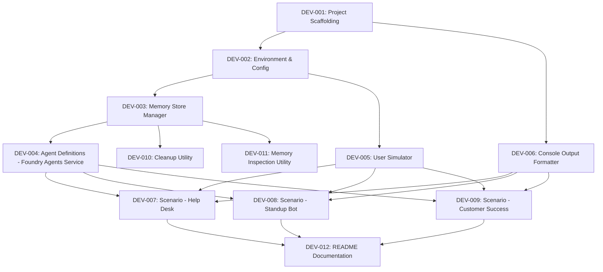

# Task Plan
## Version: 0.2.0
## PRD Version: 0.1.0
## Date: 2026-05-15
## Status: Draft

## Summary
- Total Tasks: 12
- DEV: 12 | TEST: 0 | DEPLOY: 0 | SPIKE: 0
- P0: 9 | P1: 3

## Full Task Table

| Task ID | Title | Phase | Priority | Complexity | Status | Dependencies |
|---------|-------|-------|----------|------------|--------|--------------|
| DEV-001 | Project Scaffolding | 1 | P0 | S | Backlog | — |
| DEV-002 | Environment & Config Module | 1 | P0 | S | Backlog | DEV-001 |
| DEV-003 | Memory Store Manager | 2 | P0 | M | Backlog | DEV-002 |
| DEV-004 | Agent Definitions (Foundry Agents Service) | 2 | P0 | L | Backlog | DEV-003 |
| DEV-005 | User Simulator Utility | 2 | P0 | S | Backlog | DEV-002 |
| DEV-006 | Console Output Formatter | 2 | P1 | S | Backlog | DEV-001 |
| DEV-007 | Scenario — IT Help Desk | 3 | P0 | L | Backlog | DEV-003, DEV-004, DEV-005, DEV-006 |
| DEV-008 | Scenario — Project Standup Bot | 3 | P0 | L | Backlog | DEV-003, DEV-004, DEV-005, DEV-006 |
| DEV-009 | Scenario — Customer Success | 3 | P0 | XL | Backlog | DEV-003, DEV-004, DEV-005, DEV-006 |
| DEV-010 | Cleanup Utility | 4 | P1 | S | Backlog | DEV-003 |
| DEV-011 | Memory Data Inspection Utility | 4 | P1 | M | Backlog | DEV-003 |
| DEV-012 | README Documentation | 4 | P0 | M | Backlog | DEV-007, DEV-008, DEV-009 |

## Execution Order

## Phase Plan

### Phase 1: Foundation
- Tasks: [DEV-001, DEV-002]
- Goal: Project structure, dependencies, environment configuration
- Exit Criteria: `pip install -r requirements.txt` succeeds; `src/common/env.py` loads and validates `.env`

### Phase 2: Core Infrastructure
- Tasks: [DEV-003, DEV-004, DEV-005, DEV-006]
- Goal: Reusable modules for memory CRUD, agent creation (Foundry Agents Service), user simulation, and console formatting
- Exit Criteria: Memory stores can be created/listed/deleted; agents can be created via `project_client.agents.create_agent()` with `MemorySearchTool`; simulated user messages are ready; console output is formatted

### Phase 3: Scenarios
- Tasks: [DEV-007, DEV-008, DEV-009]
- Goal: All three scenario scripts runnable end-to-end with portal-visible agents and threads
- Exit Criteria: Each scenario runs independently via `python -m src.scenarios.<name>`; agents and memory stores visible in Foundry portal; memory persistence demonstrated across sessions

### Phase 4: Utilities & Documentation
- Tasks: [DEV-010, DEV-011, DEV-012]
- Goal: Cleanup utility, memory inspection utility, comprehensive README
- Exit Criteria: `cleanup.py` removes demo resources; `inspect_memory.py` displays stored memory data; README enables setup in <15 minutes

## Traceability Matrix

| REQ ID | DEV Tasks | Notes |
|--------|-----------|-------|
| REQ-F-001 | DEV-003, DEV-007 | Store provisioned by manager, used by scenario |
| REQ-F-002 | DEV-004, DEV-007 | Agent defined in module, orchestrated by scenario |
| REQ-F-003 | DEV-005, DEV-007 | User sim provides messages, scenario runs interaction |
| REQ-F-004 | DEV-007 | Return-visit logic in scenario |
| REQ-F-005 | DEV-007 | Profile evolution in scenario |
| REQ-F-010 | DEV-003, DEV-008 | Store provisioned by manager, used by scenario |
| REQ-F-011 | DEV-004, DEV-008 | Agent defined in module, orchestrated by scenario |
| REQ-F-012 | DEV-005, DEV-008 | User sim provides messages, scenario runs interaction |
| REQ-F-013 | DEV-008 | Day 2 follow-up logic in scenario |
| REQ-F-014 | DEV-008 | Summary generation in scenario |
| REQ-F-020 | DEV-003, DEV-009 | Per-user store for CS |
| REQ-F-021 | DEV-003, DEV-009 | Team/account store for CS |
| REQ-F-022 | DEV-004, DEV-009 | Dual MemorySearchTool agent |
| REQ-F-023 | DEV-005, DEV-009 | CSM interaction simulation |
| REQ-F-024 | DEV-009 | Handoff logic in scenario |
| REQ-F-025 | DEV-009 | Account intelligence accumulation |
| REQ-F-030 | DEV-003 | Shared store manager module |
| REQ-F-031 | DEV-001, DEV-002 | .env.example + env.py |
| REQ-F-032 | DEV-010 | Cleanup utility |
| REQ-F-033 | DEV-006 | Console output formatting |
| REQ-F-034 | DEV-004, DEV-007, DEV-008, DEV-009 | Foundry Agents Service — baked into agent module and all scenarios |
| REQ-F-035 | DEV-003 | Memory stores already portal-visible via `client.beta.memory_stores.create()` |
| REQ-F-036 | DEV-011 | Memory data inspection utility |
| REQ-NF-001 | DEV-001, DEV-012 | Setup time via scaffolding + README |
| REQ-NF-002 | DEV-007, DEV-008, DEV-009 | Each scenario self-contained |
| REQ-NF-003 | DEV-003 | Idempotent store creation |
| REQ-NF-004 | DEV-002 | Clear error messages |
| REQ-NF-005 | DEV-001 | Python 3.11+ compatibility |
| REQ-NF-006 | DEV-001 | .env in .gitignore, no secrets in source |
| REQ-NF-007 | DEV-006 | Demo-readable console output |
